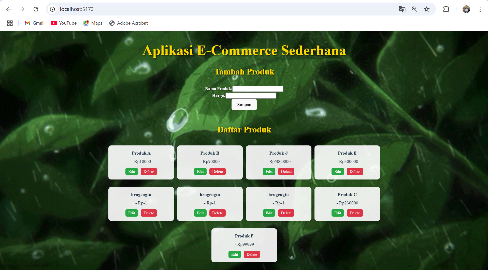
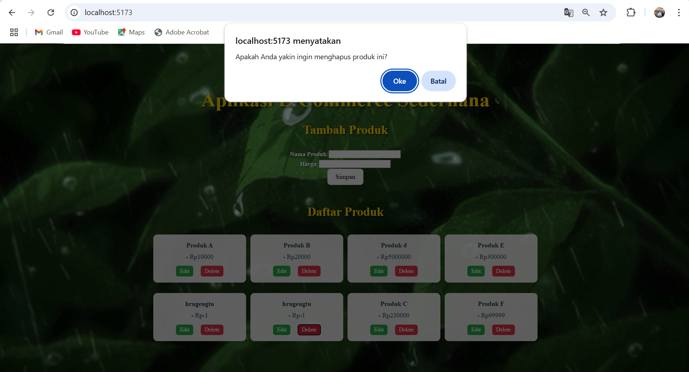
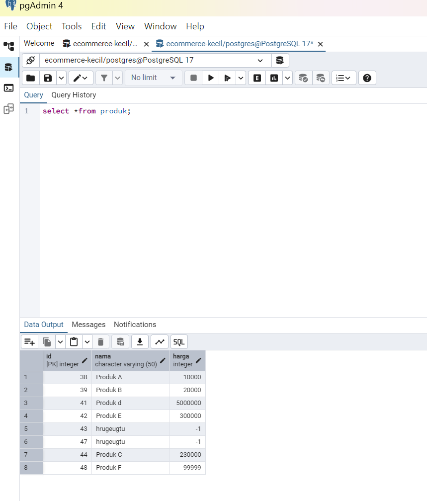
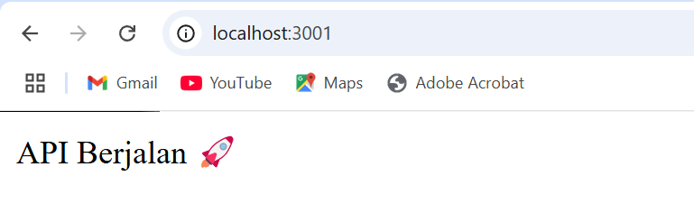
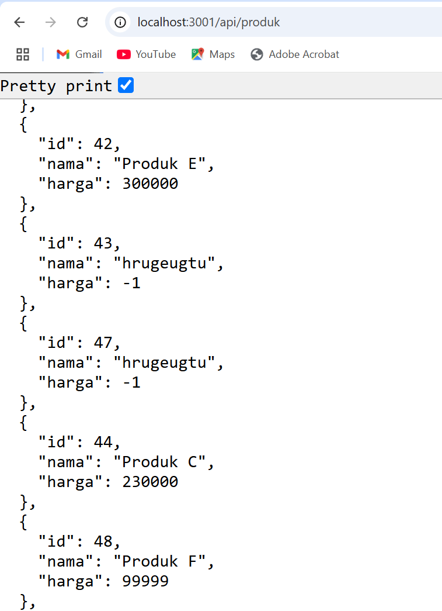

# Aplikasi CRUD dengan React, Express, dan PostgreSQL

Aplikasi ini merupakan proyek latihan untuk mengimplementasikan fitur CRUD menggunakan **React (Vite) di frontend**, **Express.js di backend**, dan **PostgreSQL sebagai database**.

## Developed by:
- Raisha Alika Irwandira (10231077)
- Yosan Pratiwi (10231091)

---
## 📌 Fitur Aplikasi
- **Menampilkan daftar produk dengan tampilan responsif**
- **Menambahkan produk baru dengan validasi input**
- **Mengedit produk yang sudah ada dengan modal form**
- **Menghapus produk dengan konfirmasi sebelum eksekusi**
- **Menerapkan notifikasi sukses/gagal pada operasi CRUD**
- **Menghubungkan frontend dan backend menggunakan API**
- **Menampilkan data dalam tabel dengan fitur pencarian dan pagination**
- **Menggunakan state management dengan React Hooks (useState, useEffect)**

---
## 🚀 Cara Install dan Menjalankan Aplikasi

### **1. Clone Repository**
```sh
git clone https://github.com/yosanpratiwi/ecommerce-kecil.git 
cd repository-name
```

### **2. Install Dependensi**
#### **Backend**
```sh
cd backend
npm install
```
#### **Frontend**
```sh
cd frontend
npm install
```

### **3. Konfigurasi Database**
1. Pastikan PostgreSQL sudah terinstall.
2. Buat database dengan nama `ecommerce_kecil`.
3. Sesuaikan konfigurasi di file `db.js`.
4. Jalankan migrasi database:
```sh
cd backend
node migrate.js
```

### **4. Menjalankan Aplikasi**
#### **Menjalankan Backend**
```sh
cd backend
node index.js
```
Backend akan berjalan di `http://localhost:3001`.

#### **Menjalankan Frontend**
```sh
cd frontend
npm run dev
```
Frontend akan berjalan di `http://localhost:5173`.

---
## 📌 Daftar Endpoint API

### **1. Endpoint Produk**
| Method | Endpoint       | Deskripsi                         |
|--------|--------------|---------------------------------|
| GET    | /api/produk   | Mendapatkan semua data produk    |
| GET    | /api/produk/:id | Mendapatkan satu produk berdasarkan ID |
| POST   | /api/produk   | Menambahkan produk baru          |
| PUT    | /api/produk/:id | Mengupdate produk berdasarkan ID |
| DELETE | /api/produk/:id | Menghapus produk berdasarkan ID |

### **2. Contoh Payload untuk POST dan PUT**
```json
{
  "nama": "Produk A",
  "harga": 10000
}
```

---
## 🎨 Teknologi yang Digunakan
- **Frontend:** React (Vite), Tailwind CSS, Axios, React Hooks
- **Backend:** Express.js, Node.js, CORS
- **Database:** PostgreSQL, pgAdmin
- **Tools:** Postman, GitHub, Railway, Vercel
- **State Management:** useState, useEffect, Context API
- **Deployment:** GitHub Actions, Vercel, Railway

---
## 📷 Screenshot Aplikasi
1. **Tampilan Tambah Produk dengan Form Validasi**


2. **Tampilan Read Data dalam Tabel dengan Pagination**


3. **Tampilan Edit Produk dengan Modal Pop-up**


4. **Tampilan Hapus Produk dengan Notifikasi Konfirmasi**


5. **Tampilan Database di pgAdmin setelah CRUD**


6. **Hasil API**



---
## 📌 Troubleshooting

### **1. Pesan "Cannot GET /" pada localhost:3001**

- Pastikan server Node.js atau Express berjalan dengan benar.
- Jika menggunakan Express, tambahkan rute di server.js atau app.js:
```js
app.get('/', (req, res) => {
    res.send('Hello, World!');
});
```
- Pastikan ada script untuk menjalankan server dengan benar.
- Jika sudah ada rute yang benar, coba restart server:
```sh
ctrl + c 
npm start
```

### **2. Nama dan harga tidak tersimpan dengan benar di database**

- Jika menggunakan Express, pastikan middleware express.json() sudah ada di server.js atau app.js:
```js
app.use(express.json());
app.use(express.urlencoded({ extended: true }));
```
- Pastikan nama kolom di database cocok dengan yang dikirim dari frontend (nama, harga).
- Pastikan query INSERT ke database sudah benar. Contoh untuk PostgreSQL dengan pg:
```js
const insertQuery = 'INSERT INTO produk (nama, harga) VALUES ($1, $2) RETURNING *';
const values = [req.body.nama, req.body.harga];

const result = await pool.query(insertQuery, values);
res.json(result.rows[0]);
```
- Periksa apakah request dikirim dalam format JSON (di Postman pilih raw JSON).
- Tambahkan log untuk memastikan data diterima dengan benar di backend:
```js
console.log(req.body);
```
### **3. Data nama dan harga tersimpan sebagai null**

- Pastikan Express bisa membaca request body JSON:
```js
app.use(express.json());
```
- Pastikan query INSERT di backend benar dan menggunakan parameterized query:
```js
const insertQuery = 'INSERT INTO produk (nama, harga) VALUES ($1, $2) RETURNING *';
const values = [req.body.nama, req.body.harga];

const result = await pool.query(insertQuery, values);
res.json(result.rows[0]);
```
- Kirim request dalam format JSON (di Postman: raw JSON).
- Cek apakah req.body berisi data yang benar:
```js
console.log(req.body);
```
- Jalankan SQL berikut di pgAdmin untuk memastikan tidak ada constraint yang mencegah insert:
```sql
INSERT INTO produk (nama, harga) VALUES ('Produk Test', 50000);
```
- Setelah perbaikan, restart server Node.js:

### **4. Data tidak tersimpan dengan benar saat insert**

- Pastikan express.json() Aktif di Backend
```js
app.use(express.json());
```
- Gunakan console.log(req.body); untuk memastikan data yang dikirim ke backend sudah sesuai.
- Validasi Data Sebelum Insert Tambahkan validasi sebelum menyimpan data:
```js
if (!req.body.nama || req.body.harga < 0) {
    return res.status(400).json({ error: "Data tidak valid" });
}
```
- Pastikan Query INSERT Menggunakan Parameter yang Benar
```js
const insertQuery = 'INSERT INTO produk (nama, harga) VALUES ($1, $2) RETURNING *';
const values = [req.body.nama, req.body.harga];
const result = await pool.query(insertQuery, values);
res.json(result.rows[0]);
```
- Hapus Data Null untuk Membersihkan Database
```sql
DELETE FROM produk WHERE nama IS NULL;
```
### **5. Kesalahan di backend**

- Tambahkan console.error(err); di bagian error handler:
```js
app.use((err, req, res, next) => {
    console.error(err);
    res.status(500).json({ error: "Server error" });
});
```
- Pastikan Database PostgreSQL Terhubung
- Tes Koneksi ke Database dengan menambahkan ini sebelum query:
```js
pool.query('SELECT 1', (err, res) => {
    if (err) {
        console.error("Database connection error", err);
    } else {
        console.log("Database connected!");
    }
});
```
- Pastikan tidak ada kesalahan pada query SQL (INSERT, SELECT, dll.).

### **6. Daftar produk tidak muncul di aplikasi**


### **6. Database PostgreSQL Tidak Terhubung**
- Pastikan PostgreSQL sudah berjalan dan user `postgres` memiliki akses.
- Cek konfigurasi di `db.js`.
- Jalankan perintah berikut di PostgreSQL untuk memastikan database sudah ada:
```sql
SELECT * FROM produk;
```

### **7. Masalah Fetch Data di Frontend**
- Pastikan backend berjalan dengan benar di `http://localhost:3001`.
- Gunakan `npm install axios` jika Axios belum terinstall.
- Pastikan CORS sudah diaktifkan di backend.


---
## 📌 Best Practices dalam Pengembangan
- **Gunakan Environment Variables:** Simpan kredensial database di `.env`.
- **Gunakan GitHub Issues & Projects:** Kelola tugas dengan jelas.
- **Gunakan Middleware di Express:** Untuk menangani error dan autentikasi.
- **Optimasi Query di PostgreSQL:** Gunakan indeks jika perlu untuk performa tinggi.
- **Pastikan UI Responsif:** Gunakan media queries dengan Tailwind CSS.

---
## 📌 Commit dan Push ke GitHub
```sh
git add .
git commit -m "Menambahkan dokumentasi dan fitur baru"
git push origin main
```


### **Inspirasi Hari Ini**
> "Mengetahui saja tidak cukup; kita harus menerapkannya. Berkeinginan saja tidak cukup; kita harus melakukannya." – Goethe

