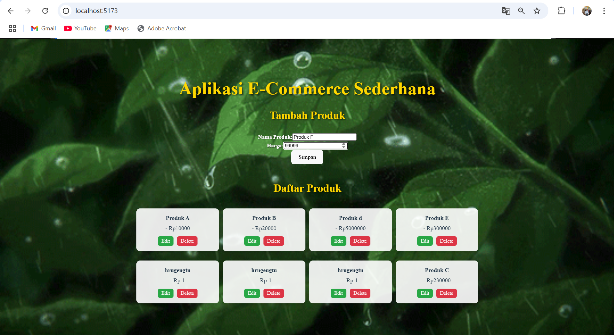
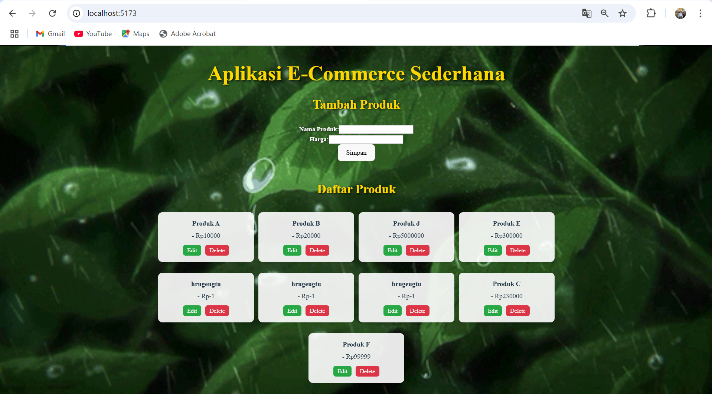
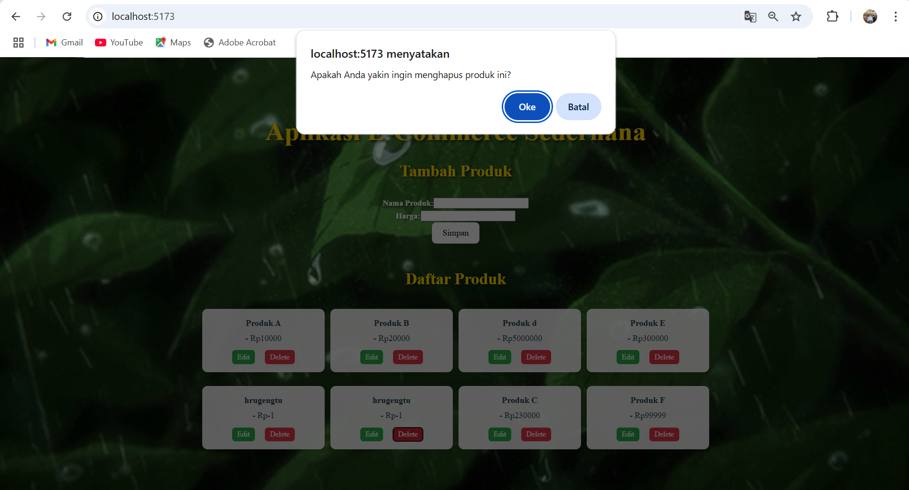
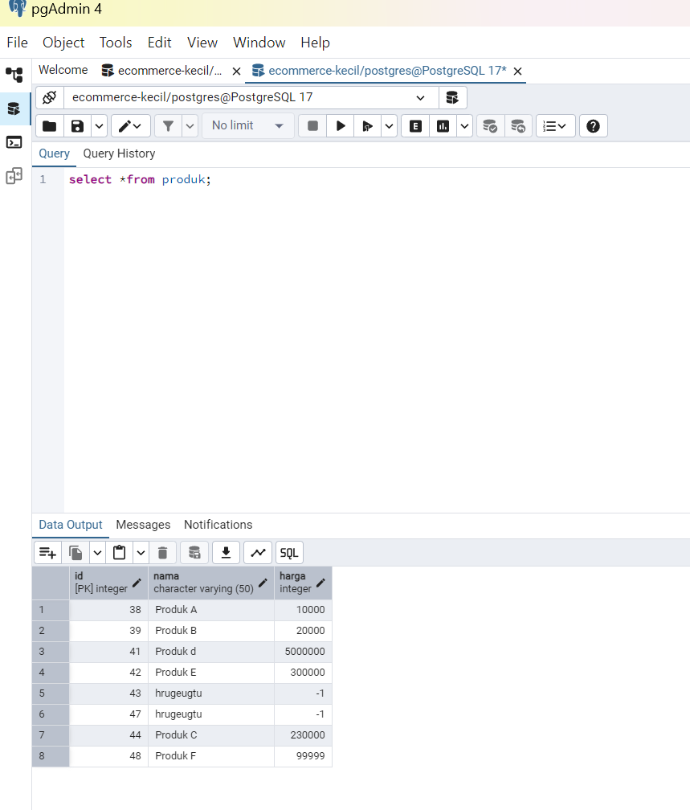
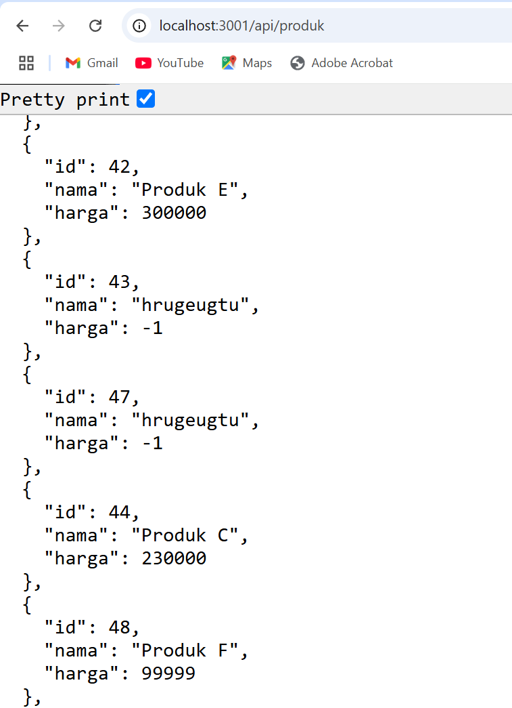
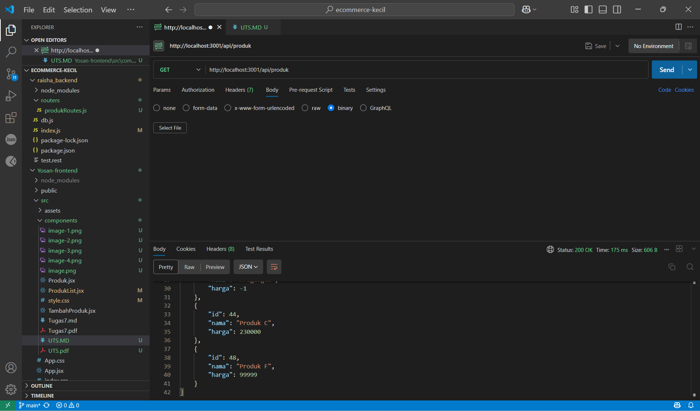
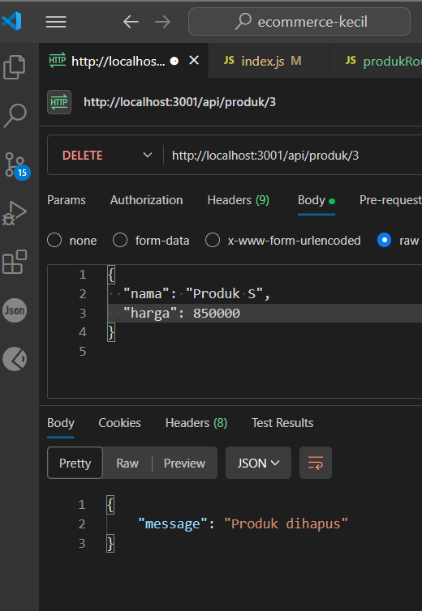

### Nama: Yosan Pratiwi
### NIM: 10231091
### UTS PROWEB

# Aplikasi CRUD dengan React, Express, dan PostgreSQL

Aplikasi ini merupakan proyek latihan untuk mengimplementasikan fitur CRUD menggunakan **React (Vite) di frontend**, **Express.js di backend**, dan **PostgreSQL sebagai database**.

---
## 📌 Fitur Aplikasi
- **Menampilkan daftar produk dengan tampilan responsif**
- **Menambahkan produk baru dengan validasi input**
- **Mengedit produk yang sudah ada dengan modal form**
- **Menghapus produk dengan konfirmasi sebelum eksekusi**
- **Menerapkan notifikasi sukses/gagal pada operasi CRUD**
- **Menghubungkan frontend dan backend menggunakan API**
- **Menampilkan data dalam tabel dengan fitur pencarian dan pagination**
- **Menggunakan state management dengan React Hooks (useState, useEffect)**

---
## 🚀 Cara Install dan Menjalankan Aplikasi

### **1. Clone Repository**
```sh
git clone https://github.com/yosanpratiwi/ecommerce-kecil.git 
cd repository-name
```

### **2. Install Dependensi**
#### **Backend**
```sh
cd backend
npm install
```
#### **Frontend**
```sh
cd frontend
npm install
```

### **3. Konfigurasi Database**
1. Pastikan PostgreSQL sudah terinstall.
2. Buat database dengan nama `ecommerce_kecil`.
3. Sesuaikan konfigurasi di file `db.js`.
4. Jalankan migrasi database:
```sh
cd backend
node migrate.js
```

### **4. Menjalankan Aplikasi**
#### **Menjalankan Backend**
```sh
cd backend
node index.js
```
Backend akan berjalan di `http://localhost:3001`.

#### **Menjalankan Frontend**
```sh
cd frontend
npm run dev
```
Frontend akan berjalan di `http://localhost:5173`.

---
## 📌 Daftar Endpoint API

### **1. Endpoint Produk**
| Method | Endpoint       | Deskripsi                         |
|--------|--------------|---------------------------------|
| GET    | /api/produk   | Mendapatkan semua data produk    |
| GET    | /api/produk/:id | Mendapatkan satu produk berdasarkan ID |
| POST   | /api/produk   | Menambahkan produk baru          |
| PUT    | /api/produk/:id | Mengupdate produk berdasarkan ID |
| DELETE | /api/produk/:id | Menghapus produk berdasarkan ID |

### **2. Contoh Payload untuk POST dan PUT**
```json
{
  "nama": "Produk A",
  "harga": 10000
}
```

---
## 🎨 Teknologi yang Digunakan
- **Frontend:** React (Vite), Tailwind CSS, Axios, React Hooks
- **Backend:** Express.js, Node.js, CORS
- **Database:** PostgreSQL, pgAdmin
- **Tools:** Postman, GitHub, Railway, Vercel
- **State Management:** useState, useEffect, Context API
- **Deployment:** GitHub Actions, Vercel, Railway

---
## 📷 Screenshot Aplikasi
1. **Tampilan Tambah Produk dengan Form Validasi**

2. **Tampilan Read Data dalam Tabel dengan Pagination**

3. **Tampilan Edit Produk dengan Modal Pop-up**

4. **Tampilan Hapus Produk dengan Notifikasi Konfirmasi**

5. **Tampilan Database di pgAdmin setelah CRUD**

6. **Hasil API Request di Postman**



    - GET

    - POST
    - PUT
    - DELETE


---
## 📌 Troubleshooting

### **1. Node.js Tidak Berjalan**

```sh
node -v
```
Pastikan Node.js sudah terinstall dengan benar.

### **1. Node.js Tidak Berjalan**


### **1. Node.js Tidak Berjalan**


### **1. Node.js Tidak Berjalan**


### **1. Node.js Tidak Berjalan**


### **1. Node.js Tidak Berjalan**


### **2. Database PostgreSQL Tidak Terhubung**
- Pastikan PostgreSQL sudah berjalan dan user `postgres` memiliki akses.
- Cek konfigurasi di `db.js`.
- Jalankan perintah berikut di PostgreSQL untuk memastikan database sudah ada:
```sql
SELECT * FROM produk;
```

### **3. Masalah Fetch Data di Frontend**
- Pastikan backend berjalan dengan benar di `http://localhost:3001`.
- Gunakan `npm install axios` jika Axios belum terinstall.
- Pastikan CORS sudah diaktifkan di backend.


---
## 📌 Best Practices dalam Pengembangan
- **Gunakan Environment Variables:** Simpan kredensial database di `.env`.
- **Gunakan GitHub Issues & Projects:** Kelola tugas dengan jelas.
- **Gunakan Middleware di Express:** Untuk menangani error dan autentikasi.
- **Optimasi Query di PostgreSQL:** Gunakan indeks jika perlu untuk performa tinggi.
- **Pastikan UI Responsif:** Gunakan media queries dengan Tailwind CSS.

---
## 📌 Commit dan Push ke GitHub
```sh
git add .
git commit -m "Menambahkan dokumentasi dan fitur baru"
git push origin main
```


### **Inspirasi Hari Ini**
> "Mengetahui saja tidak cukup; kita harus menerapkannya. Berkeinginan saja tidak cukup; kita harus melakukannya." – Goethe

